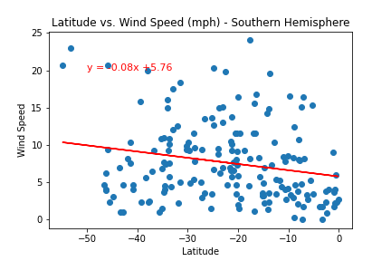

# Python API Challenge

## WeatherPy

### Lat vs Temp

North: High correlationan with negative slope in the regression, the lower the lattitude the lower the temperature

South: High correlationan with positive slope in the regression, the higher the lattitude the higher the temperature.

The slope for the southern hemisphere has a lower value, which means thar north is more sentitive to changes in temperature for one degree in latitud

---

### Lat vs Humidity

North: Correlation is low, but there is ageneral trend for humidity to increase as we get further from the ecuator

South: Correlation is low, but opposite to the north, as we get further from the ecuator the humidity decreases 

---

### Lat vs Wind speed

Both graphs shoe that the closer to the ecuator the lower the wind speed. Slope is low which means that the change in wind speed is low for one degree in latitude

---

## VacationPy

Optimal hotels for perfect conditions

